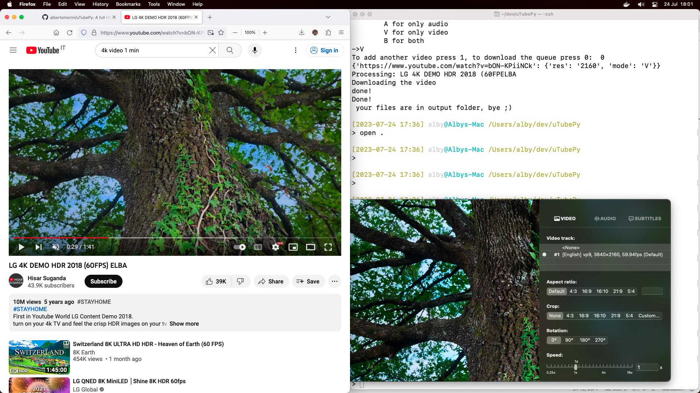
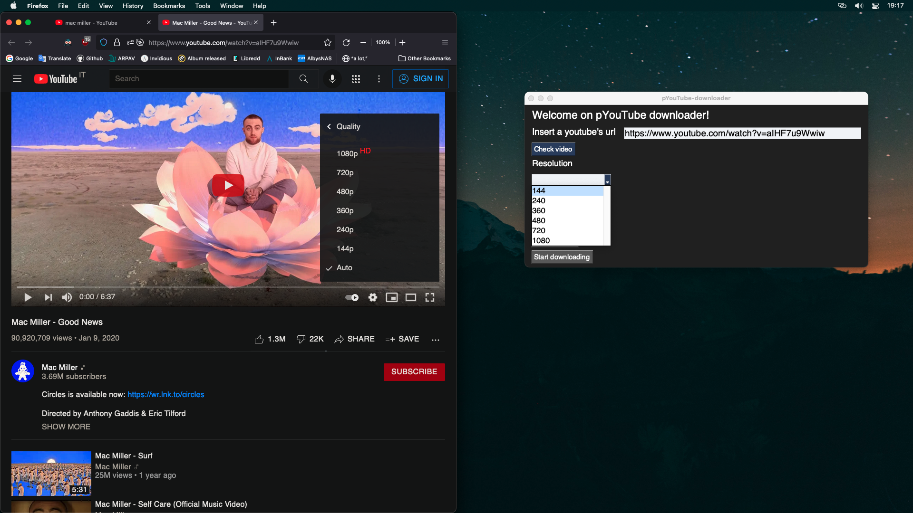
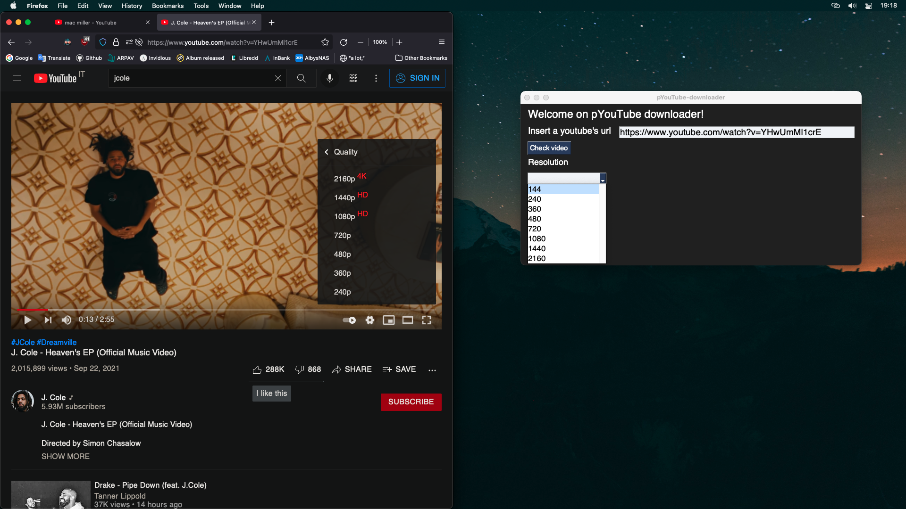

# uTubePy, a YouTube downloader.
Unlike the others YouTube downloaders, uTubePy allows you to download a video with higher resolutions (like 1080p or 4k)



## Usage:
YouTube (and other web videos provider) split audio and video, then we have to download video and audio in a separate way, next we can merge these two temp files (video.mp4,audio.mp4) into a single one.

**Install the dependencies with pip3**

## GUI version

`$ python3 gui_pytdwn.py`

### Output be like:




## CLI version
`$ python3 pyt_dwn.py`
1) then put the url, next the resolution and last the mode (A=audio only, V=video only, B=both audio and video)
2) choose if add another video or start download
3) enjoy ;)


## TODO & Problems

### PYTUBE

Using pytube, we earn all the library problems... like


- **'NoneType' object has no attribute 'span'**

	PyTube has a common issue () you can see it on their github page (https://github.com/pytube/pytube/issues).
	```
		A solution is provided by @ifahadone, you need to replace a function into "/Users/alby/Library/Python/3.8/lib/python/site-packages/pytube/cipher.py" file.
		Here link: https://github.com/pytube/pytube/issues/1243#issuecomment-1032242549
	```

* **PyTube streamdata (happened after update python to 3.11)**
	> solved via:  https://github.com/pytube/pytube/issues/1586
	a problem mainly of youtube, I had to authenticate my terminal with my google account

* Another one:
	https://github.com/pytube/pytube/issues/1707

- **Error 400 on the request, seems to be dued to age restriction**
  * Solved via: https://github.com/pytube/pytube/issues/1894
  * Error w/ Certificate solved via: https://github.com/pytube/pytube/issues/1431

- **Getting throttling function problem**
  - Solved via: https://github.com/pytube/pytube/issues/1954#issuecomment-2218287594